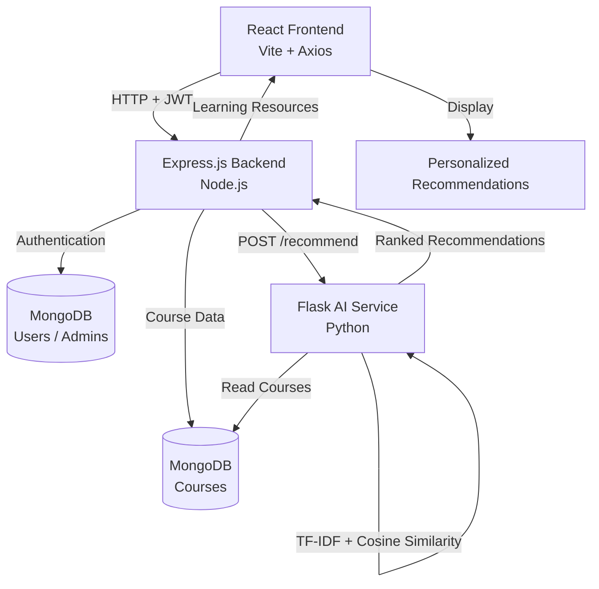
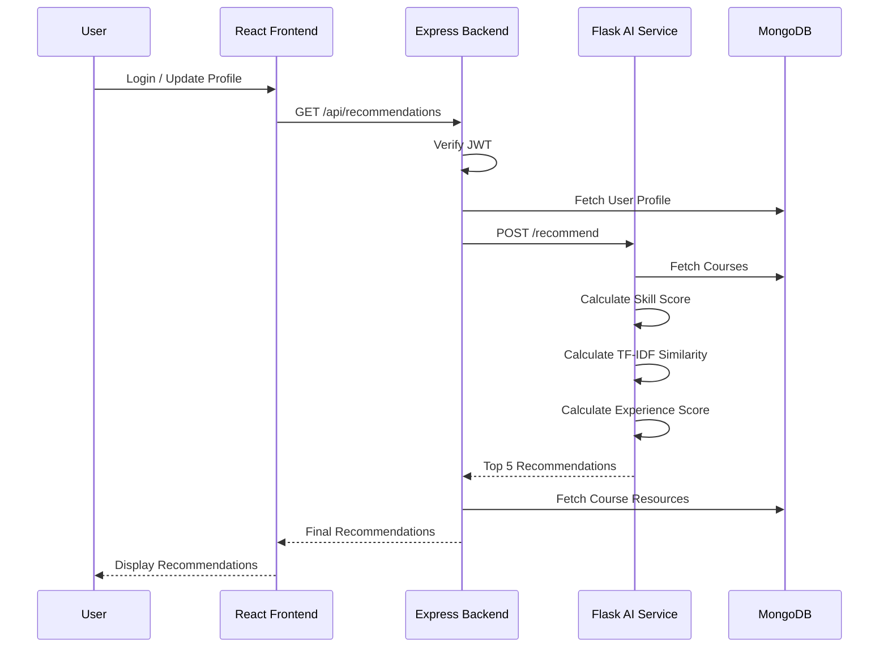

# 🎯 SkillSync – AI Learning Recommendation Platform

> A full-stack AI-powered learning recommendation platform that suggests relevant courses based on a user's skills, career goals, experience level, and interests — powered by a Python TF-IDF/cosine-similarity recommendation engine.


---

## 📖 Overview

**SkillSync** helps learners cut through the noise of endless online course catalogs by recommending courses that are relevant to their individual learning goals.

Instead of providing a generic list of popular courses, SkillSync analyzes a user's:

* 🛠️ Existing skills
* 🎯 Career goal
* 📊 Experience level
* 💡 Interests

The system calculates a personalized relevance score for courses and returns the best matches along with a human-readable explanation of why each course was recommended.

The platform also includes a lightweight **admin role** for managing the course catalog through protected backend APIs.

---

## 👥 Who It's For

SkillSync is designed for:

* 🎓 Learners deciding what to study next
* 💻 Self-taught developers looking to close skill gaps
* 🚀 Students preparing for specific career paths
* 📚 Anyone looking for personalized course recommendations
* 🎯 Learners who want recommendations based on their own profile rather than generic popularity rankings

---

# ✨ Key Features

| Feature                               | Status            |
| ------------------------------------- | ----------------- |
| User registration & login             | ✅ Implemented     |
| JWT-based authentication              | ✅ Implemented     |
| User profile management               | ✅ Implemented     |
| Profile editing                       | ✅ Implemented     |
| Skills management                     | ✅ Implemented     |
| Career goal selection                 | ✅ Implemented     |
| Experience level selection            | ✅ Implemented     |
| Interests management                  | ✅ Implemented     |
| Course catalog                        | ✅ Implemented     |
| MongoDB course storage                | ✅ Implemented     |
| Admin login                           | ✅ Implemented     |
| Admin course creation API             | ✅ Implemented     |
| AI-powered recommendations            | ✅ Implemented     |
| TF-IDF + cosine similarity            | ✅ Implemented     |
| Human-readable recommendation reasons | ✅ Implemented     |
| Recommendation relevance score        | ✅ Implemented     |
| Additional learning resources         | ✅ Implemented     |
| User-facing React UI                  | ✅ Implemented     |
| Admin Dashboard UI                    | ❌ Not implemented |

> **Note:** The main user-facing React application is implemented and provides the complete user experience for authentication, profile management, recommendations, and learning resources. The only UI currently not implemented is the dedicated Admin Dashboard.

---

# 🖥️ Frontend & User Interface

SkillSync includes a fully functional **React 19 + Vite frontend**.

### Implemented UI

* 🔐 Login and registration
* 👤 User profile
* ✏️ Profile editing
* 🛠️ Skills input
* 🎯 Career goal selection
* 📊 Experience level selection
* 💡 Interests selection
* 🤖 Personalized AI recommendations
* 📈 Recommendation match scores
* 💬 Human-readable recommendation reasons
* 📚 Course information
* 🔗 Learning resources
* 📱 User-friendly interface

The frontend communicates with the Node.js/Express backend using **Axios** and uses JWT authentication for protected operations.

### Admin UI

The backend already contains protected admin APIs for authentication and course creation. A dedicated **Admin Dashboard UI** is planned but has not yet been implemented.

---

# 🔄 How It Works

1. A user registers or logs in.
2. The user fills out their profile with:

   * Skills
   * Career goal
   * Experience level
   * Interests
3. The React frontend requests recommendations from the Node.js/Express backend.
4. The backend authenticates the request using JWT.
5. The backend loads the user's profile from MongoDB.
6. The profile is forwarded to the Python Flask AI service.
7. The AI service retrieves available courses from MongoDB.
8. Each course is scored using:

   * Skill matching
   * TF-IDF + cosine similarity
   * Experience-level matching
9. The AI service ranks all courses.
10. The top 5 courses are returned to the backend.
11. The backend enriches recommendations with additional learning resources.
12. The React frontend displays the personalized recommendations.

---

# 🔗 Application Flow

```text
                         ┌─────────────────────┐
                         │        User         │
                         └──────────┬──────────┘
                                    │
                                    ▼
                         ┌─────────────────────┐
                         │   React Frontend    │
                         │     Vite + Axios    │
                         └──────────┬──────────┘
                                    │
                              HTTP + JWT
                                    │
                                    ▼
                         ┌─────────────────────┐
                         │ Express.js Backend  │
                         │      Node.js        │
                         └──────────┬──────────┘
                                    │
                       ┌────────────┴────────────┐
                       │                         │
                       ▼                         ▼
              ┌────────────────┐       ┌─────────────────┐
              │    MongoDB     │       │  Flask AI       │
              │ Users/Courses  │       │    Service      │
              └────────────────┘       └────────┬────────┘
                                                 │
                                                 ▼
                                      ┌─────────────────────┐
                                      │ TF-IDF + Cosine     │
                                      │    Similarity       │
                                      └──────────┬──────────┘
                                                 │
                                                 ▼
                                      ┌─────────────────────┐
                                      │ Ranked Top 5        │
                                      │ Recommendations     │
                                      └──────────┬──────────┘
                                                 │
                                                 ▼
                                      ┌─────────────────────┐
                                      │ Express Backend     │
                                      │ + Learning Resources│
                                      └──────────┬──────────┘
                                                 │
                                                 ▼
                                      ┌─────────────────────┐
                                      │   React Frontend    │
                                      └──────────┬──────────┘
                                                 │
                                                 ▼
                                      ┌─────────────────────┐
                                      │ Personalized Courses│
                                      └─────────────────────┘
```

---

# 🧠 AI Recommendation System

The recommendation engine is implemented in:

```text
ai/app.py
```

SkillSync combines **content-based NLP similarity** with **rule-based scoring**.

---

## 👤 User Representation

The user's profile contains four main components:

```text
skills
careerGoal
interests
experienceLevel
```

### Example

```json
{
  "skills": ["React", "MongoDB"],
  "careerGoal": "Full Stack Developer",
  "experienceLevel": "Intermediate",
  "interests": ["Web Development"]
}
```

---

# 📚 Course Representation

Each MongoDB course contains information such as:

* `title`
* `description`
* `skills`
* `level`
* `category`
* `duration`
* `url`

Additional learning resources can include:

* YouTube
* Website
* Practice platform

---

# 🔤 TF-IDF & Cosine Similarity

SkillSync uses scikit-learn's `TfidfVectorizer` to convert text into numerical vectors.

These vectors are compared using **cosine similarity**.

### Formula

```text
              A · B
similarity = ─────────
             ||A|| ||B||
```

Where:

* `A` = TF-IDF vector representing the user's text
* `B` = TF-IDF vector representing the course text

The result ranges from:

```text
0 → No textual similarity
1 → Identical vectors
```

TF-IDF similarity is used to compare user information such as:

* Career goals
* Interests

with course information such as:

* Course category
* Description
* Skills

---

# 📊 Recommendation Scoring

For every course, SkillSync calculates four sub-scores.

| Component              |  Weight | Calculation                        |
| ---------------------- | ------: | ---------------------------------- |
| Skill Match            | **50%** | Matched skills / Total user skills |
| Career Goal Match      | **25%** | TF-IDF cosine similarity           |
| Interest Match         | **15%** | TF-IDF cosine similarity           |
| Experience Level Match | **10%** | `1` if levels match, otherwise `0` |

### Final Score

```text
final_score =
    (skill_score × 0.50)
  + (career_score × 0.25)
  + (interest_score × 0.15)
  + (level_score × 0.10)
```

This allows SkillSync to combine:

* Direct skill matching
* NLP-based textual similarity
* Experience-level matching

into a single recommendation score.

---

# 💬 Recommendation Reasons

SkillSync generates a human-readable explanation for every recommendation.

### Example

```text
This course matches your skill: react and matches your career goal and matches your experience level.
```

Reasons are generated when meaningful contributions are detected, including:

* Matching user skills
* High career-goal similarity
* High interest similarity
* Matching experience level

This makes the recommendation system more transparent to users.

---

# 🏆 Recommendation Output

All available courses are scored and sorted according to their final relevance score.

The AI service returns the **top 5 recommendations**.

The Node.js backend then enriches the recommendations with additional learning resources before sending them to the React frontend.

---

# 🏗️ System Architecture



---

# 🛠️ Technology Stack

## Frontend

* React 19
* Vite
* JavaScript / JSX
* Axios
* CSS

## Backend

* Node.js
* Express.js 5
* REST APIs
* Mongoose
* Controllers
* Routes
* Middleware

## Database

* MongoDB
* Mongoose
* PyMongo

## AI / Machine Learning

* Python
* Flask
* scikit-learn
* `TfidfVectorizer`
* `cosine_similarity`
* TF-IDF
* Content-based recommendation
* Weighted scoring

## Authentication & Security

* JSON Web Tokens (JWT)
* `jsonwebtoken`
* `bcryptjs`
* Authentication middleware
* Role-based access control

## Development Tools

* npm
* ESLint
* Git
* GitHub
* VS Code

---

# 📁 Project Structure

```text
SkillSync/
│
├── ai/                              # Python recommendation microservice
│   ├── app.py                      # Flask API /recommend endpoint
│   ├── recommendation.py           # Recommendation testing script
│   ├── test_mongodb.py             # MongoDB connectivity test
│   └── requirements.txt            # Python dependencies
│
├── backend/                        # Node.js / Express REST API
│   │
│   ├── controllers/
│   │   ├── adminController.js
│   │   ├── authController.js
│   │   ├── courseController.js
│   │   ├── recommendationController.js
│   │   └── userController.js
│   │
│   ├── middleware/
│   │   └── authMiddleware.js
│   │
│   ├── models/
│   │   ├── Admin.js
│   │   ├── Course.js
│   │   ├── Project.js
│   │   ├── Recommendation.js
│   │   ├── Skill.js
│   │   └── User.js
│   │
│   ├── routes/
│   │   ├── adminRoutes.js
│   │   ├── authRoutes.js
│   │   ├── courseRoutes.js
│   │   ├── recommendationRoutes.js
│   │   └── userRoutes.js
│   │
│   ├── createAdmin.js
│   ├── updateCourses.js
│   ├── server.js
│   ├── package.json
│   └── package-lock.json
│
└── frontend/                       # React + Vite frontend
    │
    ├── public/
    │
    ├── src/
    │   ├── assets/
    │   ├── App.jsx
    │   ├── App.css
    │   ├── index.css
    │   └── main.jsx
    │
    ├── package.json
    └── package-lock.json
```

> **Note:** `Project.js`, `Recommendation.js`, and `Skill.js` are currently placeholder model files and are not yet wired into the application.

---

# 🔌 Backend API

## 🔐 Authentication — `/api/auth`

| Method | Endpoint             | Purpose               | Auth |
| ------ | -------------------- | --------------------- | ---- |
| POST   | `/api/auth/register` | Register a new user   | ❌    |
| POST   | `/api/auth/login`    | Login and receive JWT | ❌    |

---

## 👤 User — `/api/user`

| Method | Endpoint            | Purpose                        | Auth  |
| ------ | ------------------- | ------------------------------ | ----- |
| GET    | `/api/user/profile` | Fetch logged-in user's profile | ✅ JWT |
| PUT    | `/api/user/profile` | Update user profile            | ✅ JWT |

---

## 📚 Courses — `/api/courses`

| Method | Endpoint       | Purpose           | Auth |
| ------ | -------------- | ----------------- | ---- |
| GET    | `/api/courses` | Fetch all courses | ❌    |

---

## 🤖 Recommendations — `/api/recommendations`

| Method | Endpoint               | Purpose                                | Auth  |
| ------ | ---------------------- | -------------------------------------- | ----- |
| GET    | `/api/recommendations` | Get top 5 AI-generated recommendations | ✅ JWT |

---

## 👨‍💼 Admin — `/api/admin`

| Method | Endpoint               | Purpose                            | Auth          |
| ------ | ---------------------- | ---------------------------------- | ------------- |
| POST   | `/api/admin/login`     | Admin login and JWT generation     | ❌             |
| GET    | `/api/admin/dashboard` | Protected admin dashboard endpoint | ✅ JWT + Admin |
| POST   | `/api/admin/courses`   | Create a new course                | ✅ JWT + Admin |

---

# 🧠 AI Service

The Python Flask service runs locally on:

```text
http://localhost:8000
```

| Method | Endpoint     | Purpose                                |
| ------ | ------------ | -------------------------------------- |
| GET    | `/`          | Health check                           |
| POST   | `/recommend` | Generate ranked course recommendations |

---

# 🗄️ Database

SkillSync uses **MongoDB**.

The Node.js backend communicates with MongoDB through **Mongoose**, while the Python AI service uses **PyMongo**.

Database:

```text
skillsync
```

---

## 👤 User Model

| Field             | Type     | Description                        |
| ----------------- | -------- | ---------------------------------- |
| `name`            | String   | User name                          |
| `email`           | String   | Unique email                       |
| `password`        | String   | Bcrypt-hashed password             |
| `skills`          | [String] | User skills                        |
| `careerGoal`      | String   | Career goal                        |
| `experienceLevel` | String   | Beginner / Intermediate / Advanced |
| `interests`       | [String] | User interests                     |
| `timestamps`      | —        | `createdAt` / `updatedAt`          |

---

## 👨‍💼 Admin Model

| Field      | Type   | Description            |
| ---------- | ------ | ---------------------- |
| `name`     | String | Admin name             |
| `email`    | String | Unique email           |
| `password` | String | Bcrypt-hashed password |

---

## 📚 Course Model

| Field                | Type     | Description                        |
| -------------------- | -------- | ---------------------------------- |
| `title`              | String   | Course title                       |
| `description`        | String   | Course description                 |
| `skills`             | [String] | Skills covered                     |
| `level`              | String   | Beginner / Intermediate / Advanced |
| `category`           | String   | Course category                    |
| `duration`           | String   | Course duration                    |
| `url`                | String   | Course URL                         |
| `resources.youtube`  | String   | YouTube resource                   |
| `resources.website`  | String   | Website resource                   |
| `resources.practice` | String   | Practice resource                  |

---

# 🔐 Authentication & Security

SkillSync implements authentication and authorization using JWT.

### Password Security

Passwords are hashed using:

```text
bcryptjs
```

Plain-text passwords are not stored.

### JWT Authentication

After successful login, the backend generates a JWT containing information such as:

* User ID
* Email
* Role

Protected requests use:

```text
Authorization: Bearer <token>
```

The authentication middleware verifies the JWT and attaches the decoded user information to the request.

### Role-Based Access Control

Admin-only routes require the authenticated user's role to be:

```text
admin
```

> ⚠️ **Security Note:** Before production deployment, secrets such as `JWT_SECRET` and database connection strings should be stored in environment variables rather than directly in source code.

---

# ⚙️ Installation & Setup

SkillSync contains three independently running services:

1. React Frontend
2. Node.js / Express Backend
3. Python / Flask AI Service

All three services should be running for the complete application to work.

---

# 1️⃣ Clone the Repository

```bash
git clone https://github.com/Tharunvasan/SkillSync-AI-Learning-Recommendation-Platform.git

cd SkillSync-AI-Learning-Recommendation-Platform
```

---

# 2️⃣ Backend Setup

Open a terminal:

```bash
cd backend
```

Install dependencies:

```bash
npm install
```

Start the backend:

```bash
node server.js
```

Backend:

```text
http://localhost:5000
```

### Optional Scripts

Create an admin account:

```bash
node createAdmin.js
```

Update course resources:

```bash
node updateCourses.js
```

---

# 3️⃣ Frontend Setup

Open another terminal:

```bash
cd frontend
```

Install dependencies:

```bash
npm install
```

Start the development server:

```bash
npm run dev
```

Frontend:

```text
http://localhost:5173
```

---

# 4️⃣ AI Service Setup

Open another terminal:

```bash
cd ai
```

Create a Python virtual environment:

```bash
python -m venv venv
```

### Windows

```bash
venv\Scripts\activate
```

### macOS / Linux

```bash
source venv/bin/activate
```

Install dependencies:

```bash
pip install -r requirements.txt
```

Start the Flask service:

```bash
python app.py
```

AI service:

```text
http://localhost:8000
```

Make sure MongoDB is running and the course data is available before requesting recommendations.

---

# 🚀 Usage

1. Start MongoDB.
2. Start the Node.js backend on port `5000`.
3. Start the Python AI service on port `8000`.
4. Start the React frontend on port `5173`.
5. Open the frontend in your browser.
6. Register a new account.
7. Log in.
8. Open your profile.
9. Enter:

   * Skills
   * Career goal
   * Experience level
   * Interests
10. Save your profile.
11. SkillSync generates personalized recommendations.
12. Browse recommended courses.
13. View match scores and recommendation reasons.
14. Access additional learning resources.

---

# 📸 Screenshots

The project includes a user-facing React interface.

Recommended screenshots to add to this section:

* Login / Registration
* User Profile
* Profile Editing
* Personalized Recommendations
* Course Details
* Learning Resources

Example:

```text
screenshots/
├── login.png
├── profile.png
├── recommendations.png
└── resources.png
```

Then they can be displayed in the README using:

```markdown


```

---

# 🎯 Example Recommendation

## User Profile

```json
{
  "skills": ["React", "JavaScript"],
  "careerGoal": "Full Stack Developer",
  "experienceLevel": "Intermediate",
  "interests": ["Web Development"]
}
```

## Example Result

```json
{
  "course": {
    "title": "Node.js Backend Development",
    "level": "Intermediate",
    "category": "Backend Development"
  },
  "score": 0.68,
  "reason": "This course matches your skill: javascript and matches your career goal and matches your experience level."
}
```

### Why Was It Recommended?

The recommendation is based on:

* Skill overlap
* Career-goal similarity
* Interest similarity
* Experience-level matching

These factors are combined using the weighted recommendation formula.

---

# 🔁 API / AI Flow



---

# 🔮 Future Improvements

The following features are planned improvements and are **not currently implemented**:

* [ ] Move `JWT_SECRET` and `MONGO_URI` into environment variables
* [ ] Build a complete Admin Dashboard UI
* [ ] Wire up or remove unused model files
* [ ] Persist recommendation history per user
* [ ] Add automated backend and AI-service tests
* [ ] Add pagination and filtering to the course catalog
* [ ] Containerize the application using Docker Compose
* [ ] Deploy the backend and AI service
* [ ] Add HTTPS and production security
* [ ] Improve recommendation quality using more advanced ML/NLP techniques
* [ ] Add user recommendation history
* [ ] Add course completion tracking
* [ ] Add skill-gap analysis
* [ ] Add learning roadmap generation

---

# 📚 Learning & Technical Highlights

This project demonstrates practical experience with:

### Full-Stack Development

* React
* Node.js
* Express.js
* REST APIs
* MongoDB

### Authentication & Security

* JWT authentication
* Password hashing
* Role-based access control
* Protected routes

### AI / Machine Learning

* Natural Language Processing
* TF-IDF
* Cosine similarity
* Content-based recommendation
* Weighted scoring
* Personalized recommendations

### Microservices

* Node.js ↔ Python communication
* Flask REST API
* MongoDB integration from Node.js and Python

### Software Development

* MVC-style backend architecture
* API routing
* Middleware
* Database modeling
* Git and GitHub

---

# 🤝 Contributing

Contributions are welcome.

### Steps

1. Fork the repository.
2. Create a feature branch:

```bash
git checkout -b feature/your-feature
```

3. Commit your changes:

```bash
git commit -m "Add your feature"
```

4. Push your branch:

```bash
git push origin feature/your-feature
```

5. Open a Pull Request.

For major changes, please open an issue first to discuss the proposed changes.

---

# 📄 License

This repository currently does not include a license.

If you intend to make this project open source, consider adding an **MIT License**.

---

# 👤 Author

## Tharunvasan

GitHub: [@Tharunvasan](https://github.com/Tharunvasan)

---

## ⭐ If you find this project useful

Consider giving the repository a ⭐ on GitHub!
